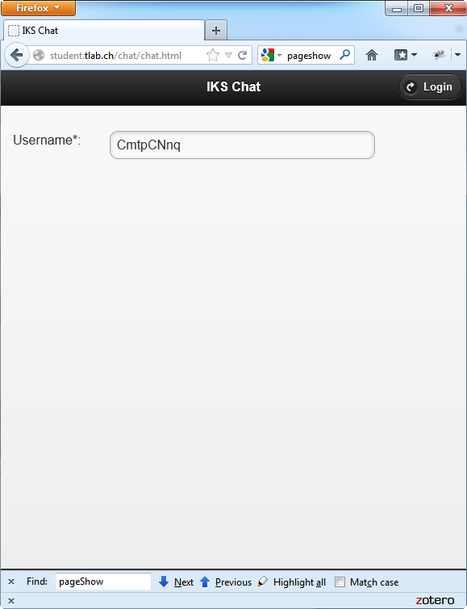
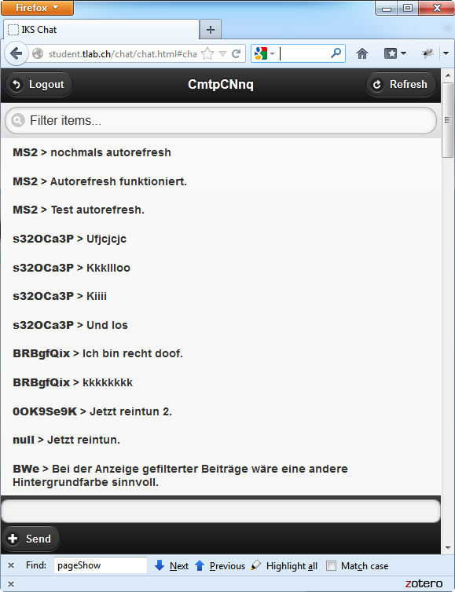

# ch.htwchur.demo.chat
Chat Demo Application

# Precondition
1. Webserver with PHP and MySQL.

# Installation/Configuration

1. Edit file config.php to configure database connection parameter.

2. Put all files on the webserver.

3. Open file setup.php in the browser. Click on button "Setup" to setup the database.
(The button setup.php can be pressed again anytime to reset the database.)

The application currently is installed on:
- http://student.tlab.ch/chat
- http://chat.tlab.ch
- http://

# Usage
1. Open file chat.html in the (mobile) browser. The login screen opens. The randomly chosen user name can be changed.

2. Click on *Login* to switch to the chat page.


## Remarks
- To delete all entries open *admin.html* and click button *Setup".
- The chat application refreshes every 4 seconds.
- If the login is done with a user name starting with *demo*, e.g. *demo10*, a chat entry is generated automatically after 1 minute inactivity.
```
demo10 > Mobile chat application. Open http://student.tlab.ch/chat, login and chat! (Sent at Fri Mar 01 2013 15:02:42 GMT+0100)
generiert.
```

